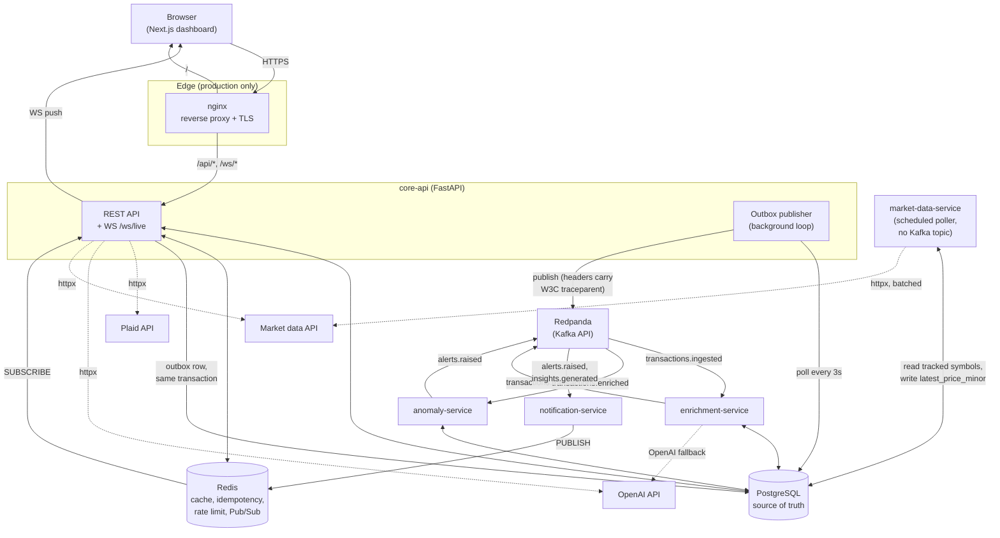
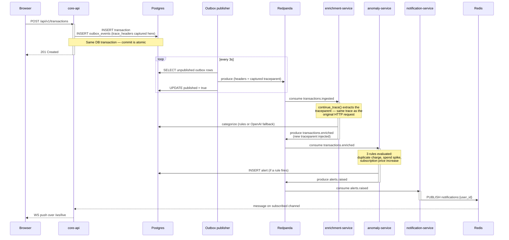
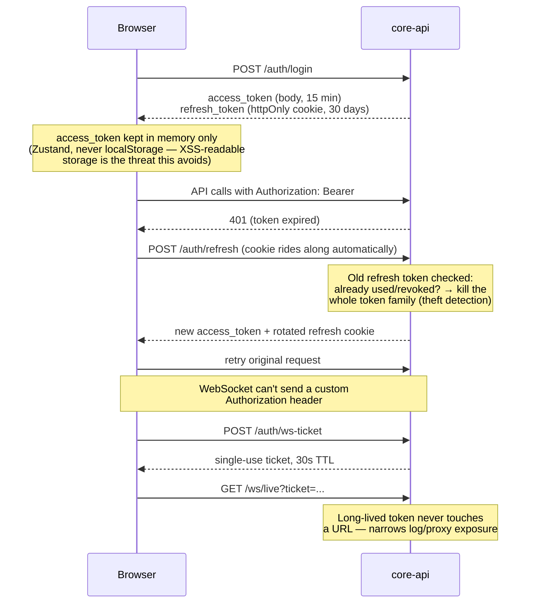
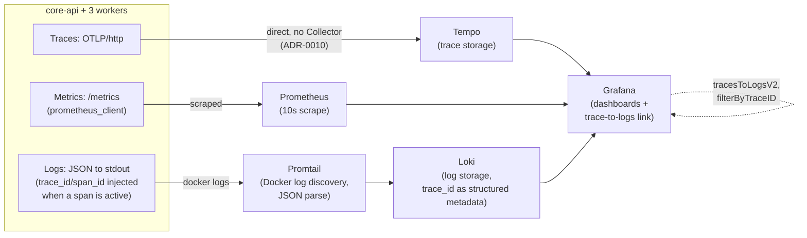
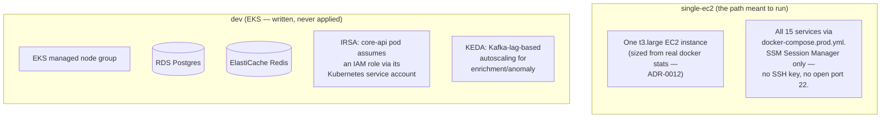

# Architecture

System diagrams for Personal Finance Platform, current as of Phase 15 (all 16 phases
complete). For the reasoning *behind* each of these — not just what the
system looks like, but why it's shaped this way — see the per-phase
docs (`docs/phase0.md` onward) and the ADRs under `docs/adr/`. This
document is the map; those are the terrain notes.

## System overview

Every arrow into Postgres from `core-api` and every consumer service
uses its own minimal, explicitly-declared column subset rather than a
shared ORM model — a documented shared-database tradeoff, not an
accident (ADR-0007). The dotted lines to Plaid/OpenAI/market-data are
all optional integrations that degrade gracefully (a typed 503, or a
deterministic fallback) when unconfigured — see "External integration
behavior" in the root README. `market-data-service` has no edge to
Kafka at all — deliberately, since nothing consumes a `prices.updated`
event today (ADR-0014); it reads and writes Postgres directly on its
own schedule, independent of `core-api`'s on-demand refresh endpoint.

## Event pipeline: one request, one trace, four services

This is the sequence a single `POST /api/v1/transactions` call for an
*uncategorized* transaction actually walks through — and, since
Phase 12, the exact shape of the single distributed trace it produces
in Tempo (verified with real trace data, not just described here — see
`docs/phase12.md`).

The idempotency guarantee that makes this safe under Kafka's
at-least-once delivery: `alerts` has a real `UNIQUE(source_event_id,
alert_type)` constraint, so a redelivered `transactions.enriched`
message re-evaluates the same rules and finds the alert already exists
rather than duplicating it (an earlier version of this was missing that
constraint despite the ADR claiming idempotency — see `docs/phase9.md`
for how that was caught).

## Auth: access tokens, rotating refresh, and WS tickets

## Observability data flow

The trace-to-logs link is genuinely functional — verified with real
data pulled from both Tempo's and Loki's own APIs during Phase 12, not
assumed from the config alone. Wiring the Grafana link alone isn't
enough on its own: without every log line carrying a `trace_id`, the
link has nothing to actually correlate against.

## Deployment topologies

Two Terraform environments exist; only one is meant to actually run —
see [ADR-0011](adr/0011-terraform-written-not-applied.md) for the full,
explicit accounting of what's applied versus what's validated-only.

See `deploy/README.md` for the actual single-EC2 deployment runbook
(first deploy, HTTPS, backups, rollback, total-loss recovery,
teardown) and `docs/phase14.md` for exactly which `terraform
validate`/`helm lint` commands were run against the EKS path and what
they did and didn't prove.
